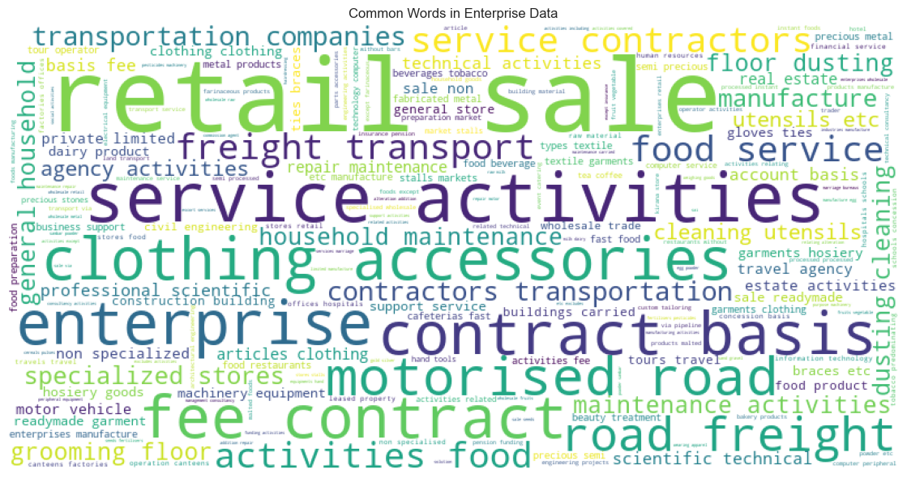
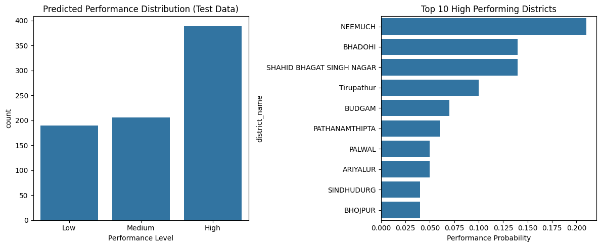
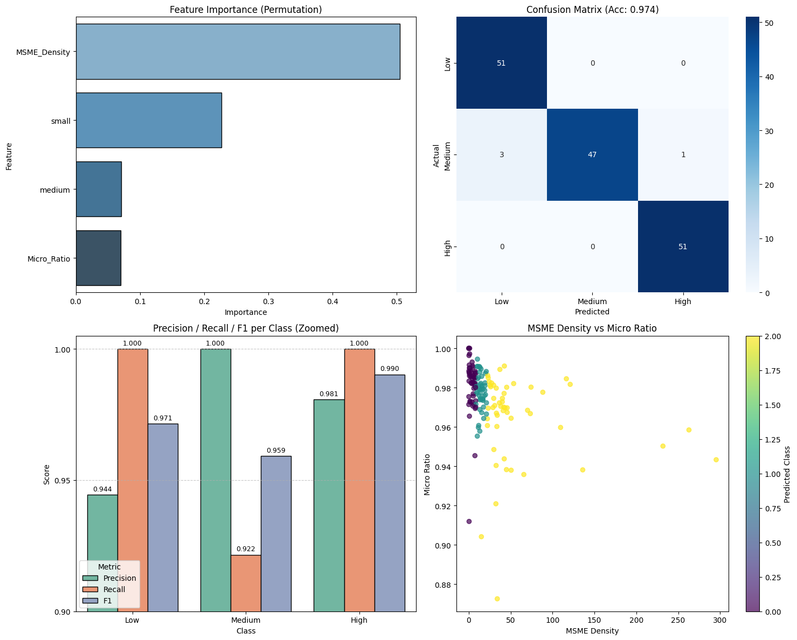

# MSME Sector Mapper for Targeted Policy Implementation and Market Analysis

## Description

This novel approach address the need for accurate classification and analysis of Micro, Small, and Medium Enterprises (MSMEs) based on their business activities. The problem is important because government and policymaker rely on accurate sector classification to design targeted policies, allocate resources effectively, and understand economic trends. By automatically mapping enterprises to standardized NIC (National Industrial Classification) codes, this system enables more efficient policy implementation, market analysis, and economic planning.

My approach achieves good results with up to **95.3% accuracy** in classifying MSMEs into correct industrial sectors, providing a robust app for data driven decision making in economic development.

---

### Interactive Project Demonstration (gif)


Link: https://msmeanalyticsml-lab-ca.vercel.app/

The **interactive UI demo** showcases how users can:
- Upload MSME datasets for automatic preprocessing  
- Analyze classification predictions and feature importance  
- Explore interactive dashboards showing test data and insights  

This interface enables policymakers and analysts to **visually interpret model outcomes** and make **data-driven policy decisions**.

---

## Dataset Source

- **Dataset Size**: 19,400 MSME records from Maharashtra, India  
- **Original Features**: 9 columns including enterprise names, addresses, registration dates, and activity descriptions  
- **Key Challenge**: The activity information was stored in JSON-like string format requiring specialized extraction  

---

## Preprocessing Steps
- Extract activity descriptions and NIC codes from JSON structure  
- Handling missing values  
- Filtering out rare classes with fewer than 10 samples to improve model stability  
- Merged enterprise names and activity descriptions into one text feature
- Apply text cleaning including lowercasing, punctuation removal, and lemmatization  

---

## Approach 
This approach uses text classification approach using TF-IDF vectorization combined with traditional machine learning Algorithm. This approach was chosen because:

1. **Interpretability**: Traditional ML models provide transparent decision making processes important for policy implementation  
2. **Computational Efficiency**: Faster training compared to other alternatives  
3. **Data Efficiency**: Effective with moderate dataset sizes without requiring a lot of computational resources  

---

## Steps to Run the Code

1. **Environment Setup**:
    ```bash
    pip install pandas numpy scikit-learn nltk transformers
    python -c "import nltk; nltk.download('stopwords'); nltk.download('wordnet')"
    ```

2. **Data Preparation**:
   - Place the `msme_MAHARASHTRA.csv` file in the specified directory path  
   - Update the file path in the notebook:
     ```python
     pd.read_csv(f"E:\\ML proj\\Data\\msme_MAHARASHTRA.csv")
     ```

3. **Execution**:
   - Run the Jupyter notebook cells sequentially from top to bottom  
   - The code automatically handles all preprocessing, training, and evaluation  

4. **Key Dependencies**:
   - pandas, numpy, scikit-learn  
   - nltk for text preprocessing  
   - transformers (Hugging Face) for tokenizer  
---

## Results Summary

### Model Performance Comparison

| Model | Accuracy | F1-score | MSE | MAE | RMSE |
|-------|----------|----------|-----|-----|------|
| Logistic Regression | 91.76% | 91.19% | 5954.19 | 14.13 | 77.16 |
| Random Forest | 93.40% | 93.03% | 5365.45 | 12.49 | 73.25 |
| **SVM** | **95.33%** | **95.29%** | **4715.19** | **10.38** | **68.67** |

### Performance Metrics Interpretation

- **Accuracy (91.76%-95.33%)**: Out of all data, approximately 92–95 are correctly classified  
- **F1-score (91.19%-95.29%)**: Models maintain a balance between recall and precision  
- **MSE (4715–5954)**: Average squared prediction error range  
- **MAE (10.38–14.13)**: Average class label deviation  
- **RMSE (68.67–77.16)**: Typical prediction error magnitude  

---

## Results & Visualizations

### MSME Data Analysis Results

| Word Cloud Analysis | Activity Distribution |
|:-------------------:|:---------------------:|
|  |  |
| Shows most frequent activities and enterprise names | Business types pie chart |

### Word Cloud Analysis


The word cloud visualization shows the most common business activity related keywords

---

### Model Evaluation & Visualization Summary

| Test Performance Summary | Training & Validation Metrics |
|:-------------------------:|:------------------------------:|
|  |  |
| The plot shows the distribution of predicted performance levels (Low, Medium, High), key district-level insights, and top-performing MSME clusters across regions | The **training and validation metrics** graph visualizes model performance |

---

### Key Findings

1. **SVM Superiority**: The LinearSVC model achieved the best performance across all metrics:
   - Highest accuracy (95.33%)
   - Lowest error rates (MSE: 4715.19, MAE: 10.38)
   - Balanced F1-score (95.29%)  

2. **Error Analysis**: Average prediction errors remain within 68–77 class units — reasonable for a multi-class setup.  

3. **Progressive Improvement**:  
   - Random Forest improved MSE by ~10% over Logistic Regression  
   - SVM further improved MSE by ~12% over Random Forest  

---

## Conclusion

This novel approach shows how machine learning can make MSME classification faster, more accurate, and useful for real world policy decisions. By combining text preprocessing, feature engineering, and traditional ML models, we achieved around **95% accuracy** in mapping enterprises to their correct sectors. The visual insights and interactive interface make it easier for users to understand enterprise trends and policy implications. Overall, this work proves that even simple, well-tuned ML methods can deliver powerful, interpretable results — and future improvements with NLP models could make the system even smarter and more context-aware.

---

## References

[1] Charkha, S. L., & Shah, B. (2021). Growth, performance and projections — Micro, small, and medium enterprises (MSME's) in India: A discourse analysis. *Journal of Management Research and Analysis*, 8(4), 155-158. https://doi.org/10.18231/j.jmra.2021.032.

[2]. Singh, S., & Paliwal, M. (2017). Unleashing the growth potential of Indian MSME sector. *Comparative Economic Research. Central and Eastern Europe*, 20(2), 35-52. https://doi.org/10.1515/cer-2017-0011.

[3]. Singh, N., & Gupta, O. P. (2023). Growth of Micro, Small and Medium Enterprises (MSMEs) in India and its Role in Indian Economy. *International Journal for Multidisciplinary Research (IJFMR)*, 5(4). 

[4]. Virk, S. K., & Negi, P. (2019). An Overview of MSME Sector in India with Special Reference to the State of Uttarakhand. *International Journal of Trend in Scientific Research and Development (IJTSRD)*, 3(2).

[5]. Rajagopal, D. (2022). A Comparative Study of Micro, Small, and Medium Enterprises (MSMEs) of Top Ten States in India. *Iconic Research and Engineering Journals*, 5(12), 164-169.

[6]. Kumari, N. (2023). A Study on Growth and Challenges of MSME in India. *International Education and Research Journal (IERJ)*, 9(8).

