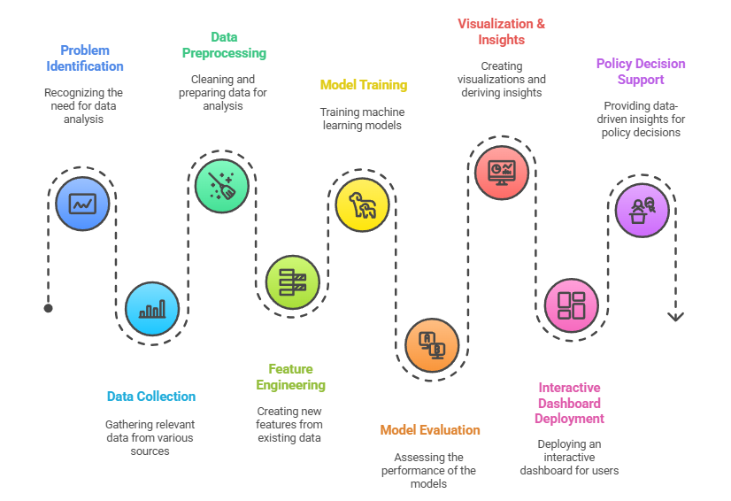

# MSME Sector Mapper for Targeted Policy Implementation and Market Analysis

### Introduction
A thriving MSME (Micro, Small, and Medium Enterprises) business sector is essential to India's vision of technology based, regionally diverse, and inclusive economic growth, with Udyam scheme enterprises emerging as innovation led, digitally enabled, and regionally diversified employment and development drivers. Ideally, these enterprises should be able to scale highly, get access to support in a timely manner, and play fairly within the economy, both in sectors and states.

This novel approach address the need for accurate classification and analysis of Micro, Small, and Medium Enterprises (MSMEs) based on their business activities. The problem is important because government and policymaker rely on accurate sector classification to design targeted policies, allocate resources effectively, and understand economic trends. By automatically mapping enterprises to standardized NIC (National Industrial Classification) codes, this system enables more efficient policy implementation, market analysis, and economic planning.

My approach achieves good results with up to **95.3% accuracy** in classifying MSMEs into correct industrial sectors, providing a robust app for data driven decision making in economic development.

---
### Dataset Overview
The data employed in this novel approach is the Ministry of Micro, Small and Medium Enterprises (MoMSME), Government of India Udyam Registration Microdata from the official Udyam portal. It contains unit-level data of all the Udyam scheme-registered firms since inception on 1 July 2020, provided at near real-time updated frequency.

Number of Rows: 250,000, each one of a distinct MSME.

Number of Columns: 10 basic fields (explained in greater detail below), connecting structured identifiers, geospatial, time, and semi-structured activity data.

### Dataset Schema

| Field Name | Description | Data Type |
| :--- | :--- | :--- |
| **LG_ST_Code** | State code (Local Government code as per Census/Administration) | INT |
| **State** | Name of the state where the MSME is registered | VARCHAR(50) |
| **LG_DT_Code** | District code (Local Government) | INT |
| **District** | District name | VARCHAR(50) |
| **Pincode** | Area postal code | INT or VARCHAR(10) |
| **RegistrationDate** | Date of MSME registration | DATE |
| **EnterpriseName** | Name of the enterprise | VARCHAR(100) |
| **CommunicationAddress** | Full communication address as provided | TEXT |
| **Activities** | JSON array of primary activity with NIC Code & Description | JSON / TEXT |

---
### Interactive Project Demonstration (gif)


Link: https://msmeanalyticsml-lab-ca.vercel.app/

The **interactive UI demo** showcases how users can:
- Upload MSME datasets for automatic preprocessing  
- Analyze classification predictions and feature importance  
- Explore interactive dashboards showing test data and insights  

This interface enables policymakers and analysts to **visually interpret model outcomes** and make **data-driven policy decisions**.

---
### Literature Review
| No. | References | Method Used | Findings | Main Objectives | Results | Limitations |
|-----|------------|--------------|----------|-----------------|---------|-------------|
| 1 | Manna & Mistri (2025) | Descriptive statistics from UAM/EM-II | Micro firms dominate (99%), regional disparities, state-level targeting | Analyze regional patterns in MSME registration | Highlights regional disparities, esp. UP, Gujarat, TN | Based on older data, lacks dynamic modeling |
| 2 | Veena (2021) | Time-series analysis of UAM/Udyam data | ~98% are micro firms; low growth trajectory despite registration boom | Assess long-term registration patterns | Finds little scale-up post-2020 surge | No survival or impact modeling |
| 3 | Sameena Banu & Suresh (2022) | Field survey of 900 Udyam units | Low tech-scheme awareness; size & regional disparities | Explore tech scheme uptake | Large awareness and uptake gaps among firms | Karnataka-only sample; low generalizability |
| 4 | Bilal Hussain (2024) | Mixed methods; Udyam registration data | Registered firms show higher R&D/credit access | Assess benefits of formal registration | Registration linked with innovation & credit uptake | Correlation, not causal proof |
| 5 | Kumaraswamy & Tamizhjyothi (2025) | District-wise registration analysis | PLI performance tied to formal enrollment density | Map registration rates to policy coverage | Regional gaps in PLI efficiency | Focused on Andhra Pradesh |
---
## Dataset Source

- **Dataset Size**: 19,400 MSME records from Maharashtra, India  
- **Original Features**: 9 columns including enterprise names, addresses, registration dates, and activity descriptions  
- **Key Challenge**: The activity information was stored in JSON-like string format requiring specialized extraction  

---

## Preprocessing Steps
- Extract activity descriptions and NIC codes from JSON structure  
- Handling missing values  
- Filtering out rare classes with fewer than 10 samples to improve model stability  
- Merged enterprise names and activity descriptions into one text feature
- Apply text cleaning including lowercasing, punctuation removal, and lemmatization  

---

## Approach 
This approach uses text classification approach using TF-IDF vectorization combined with traditional machine learning Algorithm. This approach was chosen because:



1. **Interpretability**: Traditional ML models provide transparent decision making processes important for policy implementation  
2. **Computational Efficiency**: Faster training compared to other alternatives  
3. **Data Efficiency**: Effective with moderate dataset sizes without requiring a lot of computational resources  

---

## Steps to Run the Code

1. **Environment Setup**:
    ```bash
    pip install pandas numpy scikit-learn nltk transformers
    python -c "import nltk; nltk.download('stopwords'); nltk.download('wordnet')"
    ```

2. **Data Preparation**:
   - Place the `msme_MAHARASHTRA.csv` file in the specified directory path  
   - Update the file path in the notebook:
     ```python
     pd.read_csv(f"E:\\ML proj\\Data\\msme_MAHARASHTRA.csv")
     ```

3. **Execution**:
   - Run the Jupyter notebook cells sequentially from top to bottom  
   - The code automatically handles all preprocessing, training, and evaluation  

4. **Key Dependencies**:
   - pandas, numpy, scikit-learn  
   - nltk for text preprocessing  
   - transformers (Hugging Face) for tokenizer  
---

## Results Summary

### Model Performance Comparison

| Model | Accuracy | F1-score | MSE | MAE | RMSE |
|-------|----------|----------|-----|-----|------|
| Logistic Regression | 91.76% | 91.19% | 5954.19 | 14.13 | 77.16 |
| Random Forest | 93.40% | 93.03% | 5365.45 | 12.49 | 73.25 |
| **SVM** | **95.33%** | **95.29%** | **4715.19** | **10.38** | **68.67** |

### Performance Metrics Interpretation

- **Accuracy (91.76%-95.33%)**: Out of all data, approximately 92–95 are correctly classified  
- **F1-score (91.19%-95.29%)**: Models maintain a balance between recall and precision  
- **MSE (4715–5954)**: Average squared prediction error range  
- **MAE (10.38–14.13)**: Average class label deviation  
- **RMSE (68.67–77.16)**: Typical prediction error magnitude  

---

## Results & Visualizations

### MSME Data Analysis Results

| Word Cloud Analysis | Activity Distribution |
|:-------------------:|:---------------------:|
|  |  |
| Shows most frequent activities and enterprise names | Business types pie chart |

### Word Cloud Analysis


The word cloud visualization shows the most common business activity related keywords

---

### Model Evaluation & Visualization Summary
<table>
<tr>
<td align="center" width="50%">

### Test Performance Summary  


The plot shows the distribution of predicted performance levels (Low, Medium, High), key district-level insights, and top-performing MSME clusters across regions.

</td>
<td align="center" width="50%">

### Training & Validation Metrics  


The **training and validation metrics** graph visualizes model performance.

</td>
</tr>
</table>

---

### Key Findings

1. **SVM Superiority**: The LinearSVC model achieved the best performance across all metrics:
   - Highest accuracy (95.33%)
   - Lowest error rates (MSE: 4715.19, MAE: 10.38)
   - Balanced F1-score (95.29%)  

2. **Error Analysis**: Average prediction errors remain within 68–77 class units — reasonable for a multi-class setup.  

3. **Progressive Improvement**:  
   - Random Forest improved MSE by ~10% over Logistic Regression  
   - SVM further improved MSE by ~12% over Random Forest  

---

## Conclusion

This novel approach shows how machine learning can make MSME classification faster, more accurate, and useful for real world policy decisions. By combining text preprocessing, feature engineering, and traditional ML models, we achieved around **95% accuracy** in mapping enterprises to their correct sectors. The visual insights and interactive interface make it easier for users to understand enterprise trends and policy implications. Overall, this work proves that even simple, well-tuned ML methods can deliver powerful, interpretable results — and future improvements with NLP models could make the system even smarter and more context-aware.

Overall, this research effectively integrates data engineering, machine learning, and explainable AI to forecast MSME longevity, quantify regional vulnerabilities, and deliver actionable insights, rendering it an invaluable tool for evidence-based policymaking and inclusive entrepreneurial growth in post-COVID India.

---

## References

[1] P. Manna and T. Mistri, “Status of Micro Small and Medium Enterprises (MSME) in India: A Regional Analysis,” IOSR Journal Of Humanities And Social Science (IOSR-JHSS, doi: https://doi.org/10.9790/0837-2209137282.

[2] Veena, “An Analysis of Growth of MSMEs in India,” SEDME (Small Enterprises Development, Management & Extension Journal): A worldwide window on MSME Studies, vol. 47, no. 2, pp. 138–145, Jun. 2020, doi: https://doi.org/10.1177/09708464211036216.

[3] Banu, Sameena & Suresh, B.. (2022). Registration Of MSMEs Under Technology Upgradation Schemes And Services: The Need Of The Hour. International Journal of Research In Commerce and Management Studies. 12. 01-06. link: https://www.researchgate.net/publication/380355054_Registration_Of_MSMEs_Under_Technology_Upgradation_Schemes_And_Services_The_Need_Of_The_Hour

[4] P. Aswathy, “Empowering India’s Growth: Comprehensive Insights into MSME Schemes and Employment Dynamics through Udyam Registration,” ComFin Research, vol. 12, no. 3, pp. 18–30, Jul. 2024, doi: https://doi.org/10.34293/commerce.v12i3.7540.

[5] Kumaraswamy. M, Tamizhjyothi. K, “DISTRICT-WISE ANALYSIS OF UDYAM REGISTRATION IN ANDHRA PRADESH: A CATALYST FOR ENHANCING PRODUCTION LINKED INCENTIVES (PLI) FOR MSMES,” Journal of Informatics Education and Research, vol. 5, no. 1, Feb. 2025, doi: https://doi.org/10.52783/jier.v5i1.2129.


